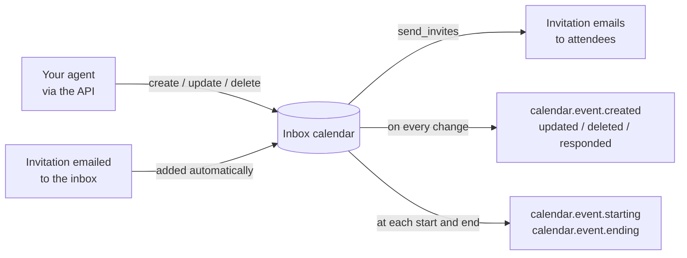

<Markdown src="../../snippets/calendar-beta.mdx" />

## What is the Calendar?

Every `Inbox` has exactly one calendar. It belongs to the inbox, uses the inbox's address as its identity, and is deleted with it. There is nothing to create: the calendar exists from the moment the inbox does.

Your agent uses the calendar in three ways:

- **Schedule.** Create one-off and recurring events through the API, optionally emailing standard calendar invitations to attendees.
- **Receive invitations.** When someone emails the inbox a calendar invitation, the event appears on the inbox's calendar automatically. Your agent can accept or decline it.
- **React in real time.** AgentMail sends `calendar.event.starting` and `calendar.event.ending` webhooks as each event begins and ends, so your agent can join a call, send a reminder or follow up without running its own scheduler.



## Core concepts

### The calendar

The calendar is addressed by its inbox: `/v0/inboxes/{inbox_id}/calendar`. It has one setting, `timezone`, the default time zone for events created without one. It starts as `UTC`.

If you delete an inbox and later create a new inbox with the same address, the new inbox gets a new, empty calendar. Events from the old inbox never carry over.

### Events, series and dates

Every event object has a `kind`:

| `kind`     | What it is                                       | `event_id`                     |
| ---------- | ------------------------------------------------ | ------------------------------ |
| `single`   | A one-off event.                                 | A UUID                         |
| `series`   | The definition of a recurring event.             | A UUID                         |
| `instance` | One date of a recurring event.                   | A dated ID, `<uuid>_<slot>`    |

A dated ID names a date by its original start in the series' time zone: `7c4e9b2a-…_t20261007T090000` for a timed date, or `…_d20261007` for an all-day date. It never changes, even if you move that date to another time. Get, Update, Delete and Respond accept either kind of ID; List Event Instances takes the event's UUID. See [Recurring Events](/calendar-recurring-events).

### Time and time zones

Event times are wall-clock times in an IANA time zone, the same way people schedule meetings:

```json
{
  "start": "2026-10-15T14:00:00",
  "end": "2026-10-15T14:30:00",
  "timezone": "America/New_York"
}
```

Responses add the matching UTC instants, `start_at` and `end_at`. These are the moments the `calendar.event.starting` and `calendar.event.ending` webhooks are due.

- **Timed events** use `YYYY-MM-DDTHH:mm:ss`, with no offset or `Z`. The `timezone` decides the offset, including daylight-saving time.
- **All-day events** set `all_day: true` and use `YYYY-MM-DD`. `end` is the last day of the event, inclusive, so a one-day event has `start` equal to `end`. An all-day event starts and ends at local midnight in its `timezone`.
- **`duration_mode`** decides what happens when a date crosses a daylight-saving change. `exact` keeps the elapsed length; `nominal` keeps the wall-clock end time. One-off timed events default to `exact`, and recurring events to `nominal`, so a weekly 09:00 meeting stays 09:00 to 10:00 local time all year.

### Where events come from

`source` is `api` for events your agent created. The inbox is their organizer, so your agent can send invitations and cancellations for them.

`source` is `email` for events created from an invitation the inbox received. Their organizer is whoever sent the invitation. Your agent can read them, edit its own copy and respond, but only the organizer can change them for everyone. See [Invitations](/calendar-invitations).

### Status

`status` is `confirmed`, `tentative` or `cancelled`. A cancelled event or date stays readable, but no `calendar.event.starting` or `calendar.event.ending` webhook is sent for it. The exception is a date cancelled while it is running: it still gets its `calendar.event.ending`. A date cancelled by deleting its dated ID is removed from the series instead, so reading it can return `404` or `410`; see [Cancel dates](/calendar-recurring-events#cancel-dates).

## Two ways to list events

`GET /calendar/events` answers two different questions:

| Question | Request | Returns |
| --- | --- | --- |
| "What have I created?" | `GET /calendar/events` | One item per one-off and recurring event, plus each individually edited date. Most recently updated first. |
| "What is on the calendar?" | `GET /calendar/events?expand=true` | Every date in a time window (default: the next 90 days), with recurring events expanded and cancelled dates left out. In start order. Recurring events' dates are included only up to about 90 days from now. |

## Quick start

<CodeBlocks>
```python title="Python"
from agentmail import AgentMail

client = AgentMail()
inbox_id = "scheduler@agentmail.to"

# create an event and email an invitation to the attendee
created = client.inboxes.calendar.create_event(
    inbox_id,
    title="Intro call with Acme",
    start="2026-10-15T14:00:00",
    end="2026-10-15T14:30:00",
    timezone="America/New_York",
    attendees=[{"email": "jane@acme.com", "name": "Jane Doe"}],
    send_invites=True,
    client_id="intro-acme-2026-10-15",  # makes retries safe
)
print(created.event.event_id, created.event.start_at)

# what is on the calendar in the next 90 days?
agenda = client.inboxes.calendar.list_events(inbox_id, expand=True)
for event in agenda.events:
    print(event.start_at, event.title)
```

```typescript title="TypeScript"
import { AgentMailClient } from "agentmail";

const client = new AgentMailClient();
const inboxId = "scheduler@agentmail.to";

// create an event and email an invitation to the attendee
const created = await client.inboxes.calendar.createEvent(inboxId, {
  title: "Intro call with Acme",
  start: "2026-10-15T14:00:00",
  end: "2026-10-15T14:30:00",
  timezone: "America/New_York",
  attendees: [{ email: "jane@acme.com", name: "Jane Doe" }],
  sendInvites: true,
  clientId: "intro-acme-2026-10-15", // makes retries safe
});
console.log(created.event.eventId, created.event.startAt);

// what is on the calendar in the next 90 days?
const agenda = await client.inboxes.calendar.listEvents(inboxId, { expand: true });
for (const event of agenda.events) {
  console.log(event.startAt, event.title);
}
```

```bash title="cURL"
curl -X POST https://api.agentmail.to/v0/inboxes/scheduler@agentmail.to/calendar/events \
  -H "Authorization: Bearer $AGENTMAIL_API_KEY" \
  -H "Content-Type: application/json" \
  -d '{
    "title": "Intro call with Acme",
    "start": "2026-10-15T14:00:00",
    "end": "2026-10-15T14:30:00",
    "timezone": "America/New_York",
    "attendees": [{ "email": "jane@acme.com", "name": "Jane Doe" }],
    "send_invites": true,
    "client_id": "intro-acme-2026-10-15"
  }'
```
</CodeBlocks>

Then subscribe a webhook to `calendar.event.starting` to act when the call begins. See [Calendar Webhooks](/calendar-webhooks).

## Reads, writes and consistency

Calendar writes are processed in one primary region. Reads are served from the region closest to you and can trail a write made moments earlier by a few seconds. To read your own write immediately, pass `consistency=primary` to Get Calendar or Get Event. Write responses always return the stored result, so you rarely need to read back.

Webhooks are sent after a change is stored, usually within seconds.

## Permissions

Calendar endpoints use their own API key permissions:

| Permission | Allows |
| --- | --- |
| `calendar_read` | Get Calendar |
| `calendar_update` | Update Calendar |
| `calendar_event_read` | Get Event, List Events, List Event Instances, and receiving `calendar.event.*` webhook and WebSocket events |
| `calendar_event_create` | Create Event |
| `calendar_event_update` | Update Event, Respond to Event |
| `calendar_event_delete` | Delete Event |

Keys created without a `permissions` object have all of them. See [Permissions](/permissions).

## Next steps

<Cards>
  <Card title="Managing Events" icon="fa-solid fa-calendar-plus" href="/calendar-events">
    Create, read, update and delete events.
  </Card>
  <Card title="Recurring Events" icon="fa-solid fa-repeat" href="/calendar-recurring-events">
    Repeat events with RRULEs and edit individual dates.
  </Card>
  <Card title="Invitations" icon="fa-solid fa-envelope-open-text" href="/calendar-invitations">
    Send invitations, receive them by email and respond.
  </Card>
  <Card title="Calendar Webhooks" icon="fa-solid fa-bell" href="/calendar-webhooks">
    React when events change, start and end.
  </Card>
  <Card title="Concurrency, Limits & Errors" icon="fa-solid fa-triangle-exclamation" href="/calendar-reference">
    ETags, idempotency, limits and error codes.
  </Card>
</Cards>
