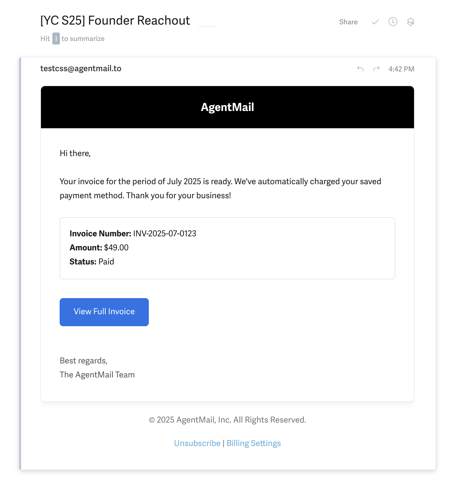

## What is a Message?

In the AgentMail ecosystem, a `Message` is the API-first representation of a traditional email. It's a structured object containing all the elements you'd expect: a sender, recipients, a subject line, and the body of the email.

Every `Message` lives inside a `Thread` to keep conversations organized. When you send a new `Message`, a new `Thread` is created. When you reply, the new `Message` is added to the existing `Thread`. Literally a normal email thread as we know it.

One of the powerful features of AgentMail is the ability to seamlessly include humans in agent-driven conversations. You can `cc` or `bcc` a real person on any message your agent sends, creating a "human-in-the-loop" workflow for oversight, escalations, or quality assurance.

## Core Capabilities

You can interact with `Message` resources in several ways, from sending new `Messages` to listing a history of correspondence.

### 1. Initialize the Client

First, you need to initialize the AgentMail client with your API key. This client object is your gateway to interacting with the AgentMail API.

<CodeBlocks>
```python title="Python"
from agentmail import AgentMail

client = AgentMail(api_key="YOUR_API_KEY")

````
```typescript title="TypeScript"
import { AgentMailClient } from "agentmail";

const client = new AgentMailClient({ apiKey: "YOUR_API_KEY" });
````

</CodeBlocks>

### 2. Send a New `Message`

To start a new conversation, you can send a `Message` from one of your inboxes. This action will create a new `Thread` and return the `Message` object.

<CodeBlocks>
```python
# You'll need an inbox ID to send from.
# Let's assume we have one:

sent_message = client.inboxes.messages.send(
inbox_id = 'my_inbox@domain.com',
to = 'recipient@domain.com',
labels=[
"outreach",
"startup"
],
subject="[YC S25] Founder Reachout ",
text="Hello, I'm Michael, and I'm a founder at AgentMail...",
html="<div dir=\"ltr\">Hello,<br><br>I'm Michael, and I'm a founder at AgentMail..."
)
print(f"Message sent successfully with ID: {sent_message.message_id}")

````
```typescript title="TypeScript"
// You'll need an inbox ID to send from.

const sentMessage = await client.inboxes.messages.send(
	"outreach@agentmail.to", // this is your inbox you are trying to send from
	{
    to: "recipient@domain.com",
		labels: [
				"outreach",
				"startup"
		],
		subject: "[YC S25] Founder Reachout ",
		text: "Hello, I'm Michael, and I'm a founder at AgentMail...",
		html: "<div dir=\"ltr\">Hello,<br><br>I'm Michael, and I'm a founder at AgentMail..."
	}
)

console.log(`Message sent successfully with ID: ${sentMessage.id}`);
````

```bash title="CLI"
# send a new message with labels
agentmail inboxes:messages send \
  --inbox-id outreach@agentmail.to \
  --to recipient@domain.com \
  --subject "[YC S25] Founder Reachout " \
  --text "Hello, I'm Michael, and I'm a founder at AgentMail..." \
  --html "<div dir=\"ltr\">Hello,<br><br>I'm Michael, and I'm a founder at AgentMail..." \
  --label outreach \
  --label startup
```

</CodeBlocks>

<Warning>
  **Recipient limit:** Each send or reply supports a maximum of **50 recipients** across the combined total of `to`, `cc`, and `bcc`. If you exceed this limit, the API will return an error.
</Warning>

### 3. List `Messages` in an `Inbox`

You can retrieve a list of all `Messages` within a specific `Inbox`. This is useful for getting a history of all correspondence.

<CodeBlocks>
```python
all_messages = client.inboxes.messages.list(inbox_id='my_inbox@agentmail.to')

print(f"Found {all_messages.count} messages in the inbox.")

````
```typescript title="TypeScript"

const allMessages = await client.inboxes.messages.list("outreach@agentmail.to")

console.log(`Found ${allMessages.count} messages in the inbox.`);
````

```bash title="CLI"
# list all messages in an inbox
agentmail inboxes:messages list --inbox-id outreach@agentmail.to
```

</CodeBlocks>

### 4. Reply to a `Message`

Replying to an existing `Message` adds your new `Message` to the same `Thread`, keeping the conversation organized.

<CodeBlocks>
```python
# Python example
reply = client.inboxes.messages.reply(
    inbox_id='my_inbox@domain.com'
    message_id='<abc123@agentmail.to>',
    text="Thanks for the referral!",
    attachments=[
        SendAttachment(
            content="resume" # this would obviously be your resume content, refer to the attachment section of the core-concepts for more details
        )
    ]
)

print(f"Reply sent successfully with ID: {reply.message_id}")

````
```typescript title="TypeScript"


const reply = await client.inboxes.messages.reply(
	"my_inbox@domain.com",
	"<abc123@agentmail.to>",
	{
		text: "Thanks for the referral!",
		attachments: [
			{
				content: "resume"
			}
		]
	}
)

console.log(`Reply sent successfully with ID: ${reply.id}`);
````

```bash title="CLI"
# reply to a message with an attachment
agentmail inboxes:messages reply \
  --inbox-id my_inbox@domain.com \
  --message-id "<abc123@agentmail.to>" \
  --text "Thanks for the referral!" \
  --attachment.content "resume" \
  --attachment.filename "resume.pdf"
```

</CodeBlocks>

<Callout>
  Note that the `inbox_id` in reply is different from send, in that this is the
  `inbox_id` we are sending FROM. Remember we can have potentially infinite
  `Inboxes` to send from, so we need to tell the api which one we are sending
  from.
</Callout>
### 5. Get a `Message`

You can retrieve the details of any specific `Message` by providing its ID along with the `inbox_id` it belongs to.

<CodeBlocks>
```python title="Python"

message = client.inboxes.messages.get(inbox_id = 'my_inbox@agentmail.to', message_id = '<abc123@agentmail.to>')

print(f"Retrieved message with subject: {message.subject}")

````
```typescript title="TypeScript"

await client.inboxes.messages.get(
	"my_inbox@domain.com",
	"<abc123@agentmail.to>"
)

console.log(`Retrieved message with subject: ${message.subject}`);
```

```bash title="CLI"
# get a specific message
agentmail inboxes:messages get \
  --inbox-id my_inbox@agentmail.to \
  --message-id "<abc123@agentmail.to>"
```
</CodeBlocks>

When receiving replies or forwards, use `extracted_text` or `extracted_html` for just the new content—quoted history is stripped automatically.

## Copy for Cursor / Claude

Copy one of the blocks below into Cursor or Claude for complete Messages API knowledge in one shot.

<CodeBlocks>
  ```python title="Python"
  """
  AgentMail Messages — copy into Cursor/Claude.

  Setup: pip install agentmail python-dotenv. Set AGENTMAIL_API_KEY in .env.

  API reference:
  - messages.send(inbox_id, to, subject, text, html?, cc?, bcc?, reply_to?, labels?, attachments?)
  - messages.list(inbox_id, limit?, page_token?, labels?)
  - messages.get(inbox_id, message_id)
  - messages.reply(inbox_id, message_id, text, html?, attachments?, reply_all?)
  - messages.forward(inbox_id, message_id, to, subject?, text?, html?)
  - messages.update(inbox_id, message_id, add_labels?, remove_labels?)
  - messages.get_attachment(inbox_id, message_id, attachment_id)
  - messages.get_raw(inbox_id, message_id)

  Reply content: use extracted_text/extracted_html for new content without quoted history.
  Errors: SDK raises on 4xx/5xx. Rate limit: 429 with Retry-After.
  """
  import os
  from dotenv import load_dotenv
  from agentmail import AgentMail

  load_dotenv()
  client = AgentMail(api_key=os.getenv("AGENTMAIL_API_KEY"))

  inbox_id = "agent@agentmail.to"

  # Send
  sent = client.inboxes.messages.send(inbox_id, to="user@example.com", subject="Hi", text="Body", labels=["outreach"])
  print(sent.message_id, sent.thread_id)

  # List, get
  res = client.inboxes.messages.list(inbox_id, limit=10)
  for msg in res.messages:
      content = msg.extracted_text or msg.text
  msg = client.inboxes.messages.get(inbox_id, res.messages[0].message_id)

  # Reply
  reply = client.inboxes.messages.reply(inbox_id, msg.message_id, text="Thanks!")
  ```

  ```typescript title="TypeScript"
  /**
   * AgentMail Messages — copy into Cursor/Claude.
   *
   * Setup: npm install agentmail dotenv. Set AGENTMAIL_API_KEY in .env.
   *
   * API reference:
   * - messages.send(inboxId, { to, subject, text, html?, cc?, bcc?, replyTo?, labels?, attachments? })
   * - messages.list(inboxId, { limit?, pageToken?, labels? })
   * - messages.get(inboxId, messageId)
   * - messages.reply(inboxId, messageId, { text, html?, attachments?, replyAll? })
   * - messages.forward(inboxId, messageId, { to, subject?, text?, html? })
   * - messages.update(inboxId, messageId, { addLabels?, removeLabels? })
   * - messages.getAttachment(inboxId, messageId, attachmentId)
   * - messages.getRaw(inboxId, messageId) -> { message_id, size, download_url, expires_at } (S3 presigned URL for .eml)
   * - messages.getRaw(inboxId, messageId)
   *
   * Reply content: use extractedText/extractedHtml for new content without quoted history.
   * Errors: SDK throws on 4xx/5xx. Rate limit: 429 with Retry-After.
   */
  import { AgentMailClient } from "agentmail";
  import "dotenv/config";

  const client = new AgentMailClient({ apiKey: process.env.AGENTMAIL_API_KEY! });

  async function main() {
    const inboxId = "agent@agentmail.to";

    const sent = await client.inboxes.messages.send(inboxId, {
      to: "user@example.com",
      subject: "Hi",
      text: "Body",
      labels: ["outreach"],
    });
    console.log(sent.messageId, sent.threadId);

    const res = await client.inboxes.messages.list(inboxId, { limit: 10 });
    for (const msg of res.messages) {
      const content = msg.extractedText ?? msg.text;
    }
    const msg = await client.inboxes.messages.get(inboxId, res.messages[0].messageId);

    await client.inboxes.messages.reply(inboxId, msg.messageId, { text: "Thanks!" });
  }
  main();
  ```
</CodeBlocks>

### Crafting Your Message: HTML, Text, and CSS

When sending a `Message`, you can provide the body in two formats: `text` for a plain-text version and `html` for a rich, styled version.

-   **`text`**: A simple, unformatted string. This is a fallback for email clients that don't render HTML, ensuring your message is always readable.
-   **`html`**: A full HTML document. This allows you to create visually rich emails with custom layouts, colors, fonts, and images.

<Tip>
  **Best Practice**: Always send both `text` and `html` versions.
</Tip>

## "Why both text and HTML?"

Most modern email clients will display the HTML version, not all of them can render HTML -- a text fallback makes sure your message is displayed regardless. Furthermore it significantly improves deliverability.

#### Styling with CSS

To style your HTML in the `Message`, you should embed your CSS directly inside a `<style>` tag in the `<head>` in the payload of the API request. This is the most reliable method for ensuring your styles are applied correctly across different email clients like Gmail, Outlook, and Apple Mail.

Here is an example of a well-structured and styled HTML header:

<CodeBlocks>
```html title="Styled HTML Email Example"
<html>
  <head>
    <meta charset="UTF-8">
    <meta name="viewport" content="width=device-width, initial-scale=1.0">
    <title>Your AgentMail Invoice</title>
    <style>
      body {
        font-family: -apple-system, BlinkMacSystemFont, 'Segoe UI', Roboto, Helvetica, Arial, sans-serif;
        line-height: 1.6;
        color: #333;
        max-width: 600px;
        margin: 0 auto;
        padding: 20px;
        background-color: #f8f9fa;
      }
      .email-wrapper {
        background: #ffffff;
        border: 1px solid #e9ecef;
        border-radius: 8px;
        box-shadow: 0 4px 8px rgba(0, 0, 0, 0.05);
        overflow: hidden;
      }
      .email-header {
        background-color: #000000;
        color: #ffffff;
        padding: 24px;
        text-align: center;
      }
      .email-header h1 {
        margin: 0;
        font-size: 24px;
        font-weight: 600;
      }
      .email-content {
        padding: 32px;
      }
      .greeting {
        font-size: 18px;
        font-weight: 500;
        margin-bottom: 24px;
      }
      .main-message {
        font-size: 16px;
        margin-bottom: 24px;
      }
      .cta-button {
        display: inline-block;
        padding: 12px 24px;
        background-color: #1a73e8;
        color: #ffffff;
        text-decoration: none;
        border-radius: 6px;
        font-weight: 500;
        font-size: 16px;
        margin-top: 8px;
        margin-bottom: 24px;
      }
      .invoice-details {
        background-color: #f8f9fa;
        padding: 16px;
        border-radius: 6px;
        margin-bottom: 24px;
        border: 1px solid #dee2e6;
      }
      .invoice-details p {
        margin: 0;
        font-size: 14px;
      }
      .invoice-details strong {
        color: #000;
      }
      .signature {
        margin-top: 24px;
        font-size: 14px;
        color: #555;
      }
      .email-footer {
        text-align: center;
        padding: 20px;
        font-size: 12px;
        color: #6c757d;
      }
      .email-footer a {
        color: #1a73e8;
        text-decoration: none;
      }
    </style>
  </head>
  <body>
    <div class="email-wrapper">
      <div class="email-header">
        <h1>AgentMail</h1>
      </div>
      <div class="email-content">
        <div class="greeting">Hi there,</div>
        <div class="main-message">
          Your invoice for the period of October 2025 is ready. We've automatically charged your saved payment method. Thank you for your business!
        </div>

        <div class="invoice-details">
          <p><strong>Invoice Number:</strong> INV-2025-10-0123</p>
          <p><strong>Amount:</strong> $49.00</p>
          <p><strong>Status:</strong> Paid</p>
        </div>

        <a href="#" class="cta-button">View Full Invoice</a>

        <div class="signature">
          Best regards,<br>
          The AgentMail Team
        </div>
      </div>
    </div>
    <div class="email-footer">
      <p>&copy; 2025 AgentMail, Inc. All Rights Reserved.</p>
      <p><a href="#">Unsubscribe</a> | <a href="#">Billing Settings</a></p>
    </div>
  </body>
</html>
```
</CodeBlocks>

<Frame caption="Look how pretty this message looks!">
  
</Frame>

## A Note on `text` Availability

The `text` and `preview` fields on a received `Message` are derived from the email's plain-text (`text/plain`) MIME part. Some email clients — particularly Gmail and Outlook — send forwarded emails as HTML-only, with no plain-text part. In these cases, `text` and `preview` will be absent.

When processing incoming messages, always treat `html` as the primary content source and `text` as optional.

## Receiving `Messages`

<Warning>
**Inbound emails are checked for SPF, DKIM, and DMARC authentication.** AgentMail drops emails when authentication headers are present and explicitly fail. When authentication headers are missing, AgentMail still processes the email and labels it `unauthenticated`. Subscribe to the `message.received.unauthenticated` event to monitor these messages. See [Why are my emails not showing up?](/knowledge-base/inbound-emails-missing) for details.
</Warning>

While you can periodically list `Messages` to check for new emails, the most efficient way to handle incoming `Messages` for your agents is with `Webhooks`. By configuring a `Webhook` endpoint, AgentMail can notify your application/agent in real-time as soon as a new `Message` arrives, so you can take action on them.

<CardGroup>
  <Card
    title="Guide: Webhooks"
    icon="fa-solid fa-bolt"
    href="/webhooks-overview"
  >
    Learn how to set up webhooks for real-time message processing.
  </Card>
</CardGroup>

### Marking Messages as Read

AgentMail doesn't have a dedicated "mark as read" endpoint — instead, you use [Labels](/labels) to track read/unread state. This is a common pattern to prevent your agent from reprocessing the same emails.

<CodeBlocks>
```python title="Python"
# Mark a message as read after processing
client.inboxes.messages.update(
    inbox_id="agent@agentmail.to",
    message_id=msg.message_id,
    add_labels=["read"],
    remove_labels=["unread"]
)

# Only fetch unread messages
unread = client.inboxes.messages.list(
    inbox_id="agent@agentmail.to",
    labels=["unread"]
)
```

```typescript title="TypeScript"
// Mark a message as read after processing
await client.inboxes.messages.update(
  "agent@agentmail.to",
  msg.messageId,
  {
    addLabels: ["read"],
    removeLabels: ["unread"],
  }
);

// Only fetch unread messages
const unread = await client.inboxes.messages.list(
  "agent@agentmail.to",
  { labels: ["unread"] }
);
```

```bash title="CLI"
# mark a message as read after processing
agentmail inboxes:messages update \
  --inbox-id agent@agentmail.to \
  --message-id "<message_id>" \
  --add-label read \
  --remove-label unread

# only fetch unread messages
agentmail inboxes:messages list \
  --inbox-id agent@agentmail.to \
  --label unread
```
</CodeBlocks>

<Callout intent="info" title="Avoiding duplicate processing">
If your agent uses webhooks, mark each message as `read` (or `processed`) immediately after handling it. Then, if your agent restarts or reprocesses, filter by `labels=["unread"]` to skip messages that have already been handled.
</Callout>
````
