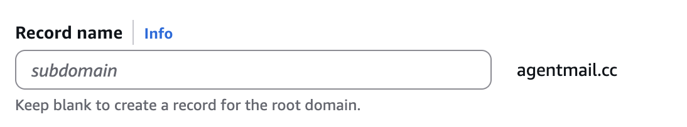

## Why Use a Custom Domain?

When you're deploying AI agents that send email at scale, deliverability and trust are paramount. While the default `@agentmail.to` domain is great for getting started, using your own custom domains is essential for production applications. It gives you control over your sending reputation and enables advanced strategies for high-volume outreach.

<CardGroup>
  <Card
    title="Improved Deliverability"
    icon="fa-solid fa-envelope-circle-check"
  >
    Each domain builds its own sending reputation. By using your own domain, you
    control this reputation, which is the single most important factor in
    reaching the inbox.
  </Card>
  <Card title="Scale with Multiple Domains" icon="fa-solid fa-network-wired">
    For high-volume sending, register multiple domains (e.g., `mercor.com`,
    `usemercor.com`, `mercorapp.com`). Spreading email volume across them is a
    key strategy to maximize deliverability.
  </Card>
</CardGroup>

## Setting Up Your Custom Domain

Configuring your domain is a three-step process: add the domain via API, copy the provided records into your DNS provider, and wait for verification.

<Steps>
<Step title="1. Create Domain & Get DNS Records">

To begin, make an API request to the `POST /domains/{domain}` endpoint with your domain name. AgentMail will register your domain and immediately return the full set of DNS records required for verification.

<CodeBlocks>
  ```bash curl -X POST https://api.agentmail.to/domains/your-domain.com ```
</CodeBlocks>

<Callout type="info" title="Feedback Forwarding">
  By default, bounce and complaint notifications are sent to your domain. You
  can disable this by setting `feedback_forwarding` to `false` in your request.
  If not specified it is default set to `true`
</Callout>

The API response includes a `records` array. Each object in this array contains the precise `name`, `type`, `value`, and `priority` you'll need to add to your DNS provider.

The initial `status` of the domain will be `pending`. It will change as you configure your domain and we verify it on our end.

</Step>

<Step title="2. Add Records to Your DNS Provider">
The process for adding records varies slightly between providers. The examples below assume you are configuring the root domain `domain.com`.

<Callout title="Configuring a Subdomain?">
  If you're using a subdomain (e.g., `payment.domain.com`), the instructions are
  the same, but you must PREPEND the subdomain to the record NAME VALUE. For
  example, a `_dmarc` record for `domain.com` becomes `_dmarc.payment` for
  `payment.domain.com`. For records on the subdomain itself (like an MX record
  for `payment.domain.com`), the name would simply be `payment`.
</Callout>

Below are detailed instructions for AWS Route53 and Cloudflare. If you would like detailed instructions on your specific domain provider in this section please contact us contact@agentmail.cc

<Tabs>
  <Tab title="AWS Route 53">
    In your hosted zone, click **"Create record"**.

    - **CNAME (DKIM):**
      - **Record name:** Enter the part of the `name` before your root domain (e.g., `{random_letters_numbers}._domainkey` for a `name` of `{random_letters_numbers}._domainkey.domain.com`).
      - **Value:** Can directly copy paste the `value` from the API response (e.g., `{random_letters_numbers}.dkim.amazonses.com`).


    <Frame caption="Example of adding a CNAME record in Route 53. Notice that AWS already appends the root domain (agentmail.cc) to the end of the name value!">
      
    </Frame>

    - **TXT (DMARC/SPF):**
      - **Record name:** Enter the part of the `name` before your root domain (e.g., `_dmarc` for a `name` of `_dmarc.domain.com`, or `mail` for a `name` of `mail.domain.com`).
      - **Value:** Can copy paste the`value` from the API, ensuring it is enclosed in quotes.

    - **MX:**
      - **Record name:** Leave this field blank to apply the record to the root domain.
      - **Value:** This is critical. You must combine the `priority` and `value` from the API into a single string, separated by a space. For example: `10 inbound-smtp.us-east-1.amazonaws.com`.

  </Tab>
  <Tab title="Cloudflare">
    In the dashboard (**DNS > Records**), click **"Add record"**.

    - **CNAME (DKIM):**
      - **Name:** Enter the part of the `name` before your root domain (e.g., `{random_letters_numbers}._domainkey`).
      - **Target:** Copy paste the `value` from the API response.

    - **TXT (DMARC/SPF):**
      - **Name:** Enter the part of the `name` before your root domain (e.g. `_dmarc`).
      - **Content:** Copy paste the `value` from the API response.

    - **MX:**
      - **Name:** Enter `@` to apply the record to the root domain.
      - **Mail server:** Enter the `value` from the API.
      - **Priority:** Enter the `priority` from the API.

  </Tab>
</Tabs>
</Step>
<Step title="3. Verify Your Domain">
Once you've added the records, AgentMail automatically begins to check them. This can take anywhere from a few minutes to 48 hours for your DNS changes to propagate across the internet.

You can poll the `GET /domains/{domain}` endpoint to check the verification progress. The `status` field in the response will tell you exactly where you are in the process:

- **`pending`**: This means you still need to add or fix your DNS records. The `records` array in the response will show you which records are still missing or invalid.
- **`verifying`**: This is a great sign! It means our system has confirmed your DNS records are correct, and we are now authorizing the domain with our underlying email infrastructure. No action is needed from you—just a little more patience.
- **`ready`**: This is the final step. Your domain is fully verified and ready for sending. You can now create inboxes and start sending emails.

</Step>
</Steps>

Here are instructions for some common DNS providers. This list is not exhaustive, so please consult your provider's documentation if you don't see it here.

| DNS/Hosting Provider | Documentation Link                                                                                                                                                                                                                                                                                                                                                                                                                                                                                                                                        |
| :------------------- | :-------------------------------------------------------------------------------------------------------------------------------------------------------------------------------------------------------------------------------------------------------------------------------------------------------------------------------------------------------------------------------------------------------------------------------------------------------------------------------------------------------------------------------------------------------- |
| **GoDaddy**          | [CNAME: Add a CNAME record](https://www.godaddy.com/help/add-a-cname-record-19236) <br/> [MX: Add an MX record](https://www.godaddy.com/help/add-an-mx-record-19234) <br/> [TXT: Add a TXT record](https://www.godaddy.com/help/add-a-txt-record-19232)                                                                                                                                                                                                                                                                                                   |
| **DreamHost**        | [CNAME/MX/TXT: How do I add custom DNS records?](https://help.dreamhost.com/hc/en-us/articles/215414867-How-do-I-add-custom-DNS-records)                                                                                                                                                                                                                                                                                                                                                                                                                  |
| **Cloudflare**       | [MX: How do I add or edit mail or MX records?](https://support.cloudflare.com/hc/en-us/articles/200168806-Managing-DNS-records-in-Cloudflare) <br/> [TXT: Managing DNS records in Cloudflare](https://support.cloudflare.com/hc/en-us/articles/200168806-Managing-DNS-records-in-Cloudflare)                                                                                                                                                                                                                                                              |
| **HostGator**        | [CNAME/MX/TXT: Manage DNS Records with HostGator/eNom](https://www.hostgator.com/help/article/manage-dns-records-with-hostgator-enom)                                                                                                                                                                                                                                                                                                                                                                                                                     |
| **Namecheap**        | [CNAME: How to create a CNAME record](https://www.namecheap.com/support/knowledgebase/article.aspx/9646/2237/how-to-create-a-cname-record-for-your-domain/) <br/> [MX: How can I set up MX records required for mail service?](https://www.namecheap.com/support/knowledgebase/article.aspx/434/2237/how-can-i-set-up-mx-records-required-for-mail-service) <br/> [TXT: How do I add TXT/SPF/DKIM/DMARC records for my domain?](https://www.namecheap.com/support/knowledgebase/article.aspx/317/2237/how-do-i-add-txtspfdkimdmarc-records-for-my-domain) |
| **Names.co.uk**      | [CNAME/MX/TXT: Changing your domain's DNS settings](https://www.names.co.uk/support/articles/changing-your-domains-dns-settings/)                                                                                                                                                                                                                                                                                                                                                                                                                         |
| **Wix**              | [CNAME: Adding or Updating CNAME Records](https://support.wix.com/en/article/adding-or-updating-cname-records-in-your-wix-account) <br/> [MX: Adding or Updating MX Records in Your Wix Account](https://support.wix.com/en/article/adding-or-updating-mx-records-in-your-wix-account) <br/> [TXT: Adding or Updating TXT Records in Your Wix Account](https://support.wix.com/en/article/adding-or-updating-txt-records-in-your-wix-account)                                                                                                             |

<Callout type="success" title="Ready to Go!" icon="fa-solid fa-rocket">
  Once your domain status is `ready`, you can start creating `Inboxes` with your
  custom domain and building your agents!
</Callout>

## Troubleshooting Common DNS Issues

DNS can be tricky. Here are some common issues and how to resolve them.

<AccordionGroup>
  <Accordion title="My DNS changes aren't showing up instantly">
    DNS propagation can take up to 48 hours, though it's often much faster. If
    it's been a while, double-check by hitting the `GET /domains/{domain}`
    endpoint to check the status. It will tell you exactly which records are
    configured correctly or missing.
  </Accordion>
  <Accordion title="I'm seeing 'Too many SPF records' errors">
    A domain must have only **one** SPF record. If you're using other services that send email on your behalf (like a CRM), you need to merge their SPF policies with AgentMail's into a single record.

    An SPF record is a single line of text. It starts with `v=spf1` and ends with a mechanism like `~all` or `-all`. All your permitted senders go in the middle.

    **How to Merge:**

    1.  **Find your existing SPF record.** It will look something like this: `v=spf1 include:_spf.other-domain.com ~all`
    2.  **Find AgentMail's SPF include.** This is `include:spf.agentmail.to`.
    3.  **Combine them.** Copy the `include` from AgentMail and place it into your existing record, right before the `~all` or `-all` part.

    <CodeBlocks>
    ```text title="Example: Merging SPF records"
    # Before
    v=spf1 include:_spf.other-domain.com ~all

    # After
    v=spf1 include:_spf.other-domain.com include:spf.agentmail.to ~all
    ```
    </CodeBlocks>

    Just keep adding `include:` mechanisms for each service you use. Remember to only have one `v=spf1` at the beginning and one `~all` or `-all` at the end.

  </Accordion>

</AccordionGroup>

{/* The user will write this section themselves. */}

## Best Practices for Domain Management

Check out our guide on [Email Deliverability](/best-practices/email-deliverability) for tips on warming up your new domain and maintaining a healthy sender reputation.
