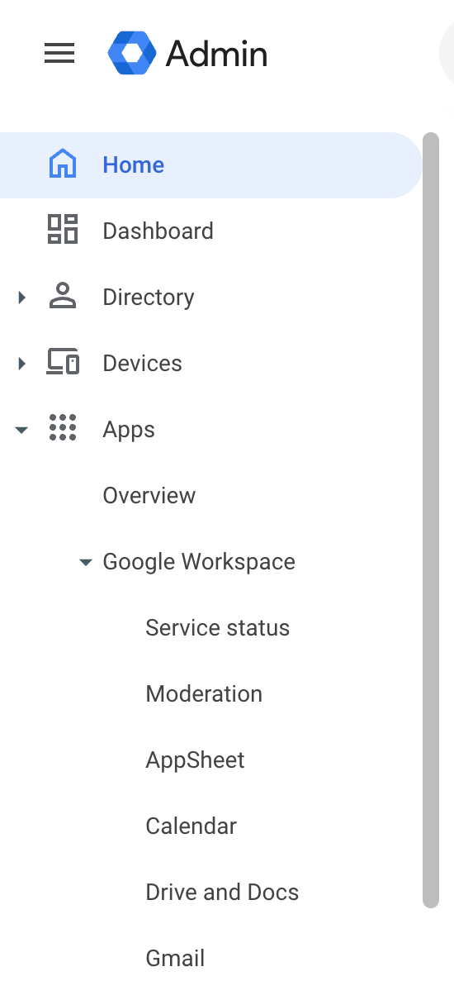
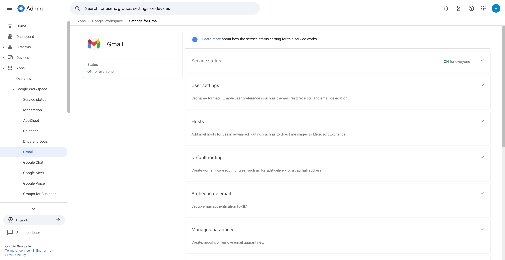
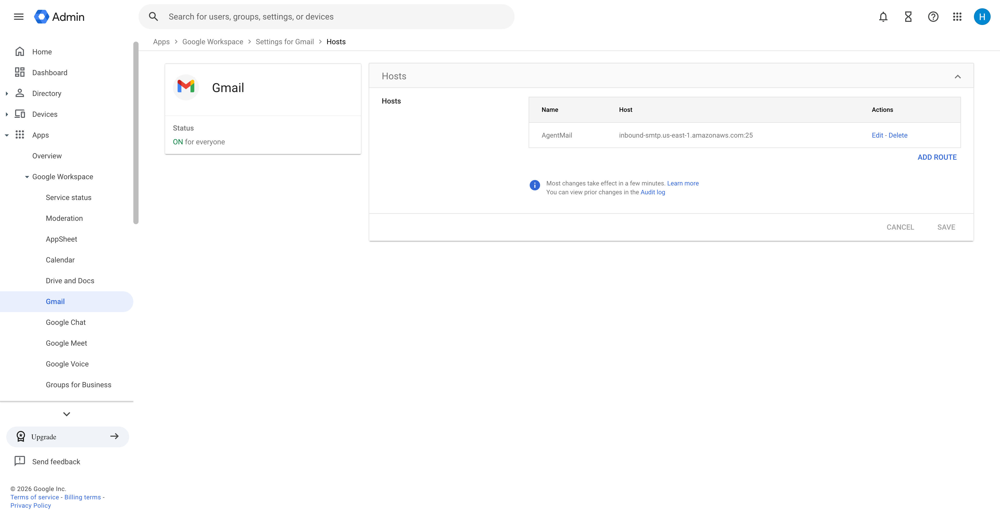
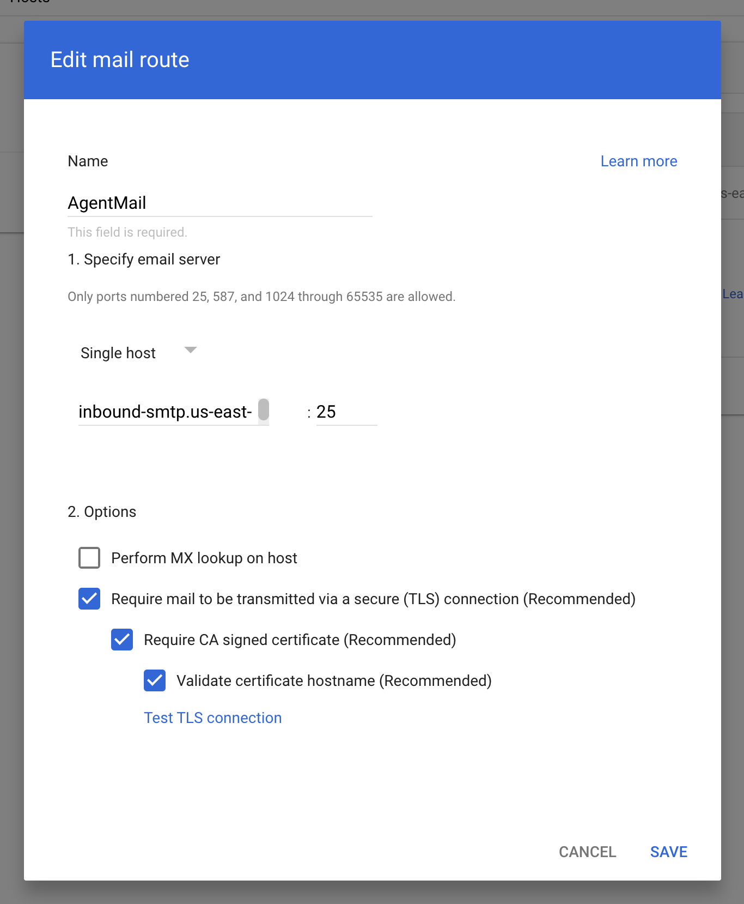
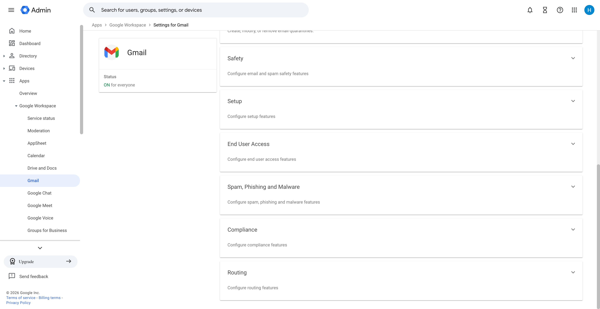
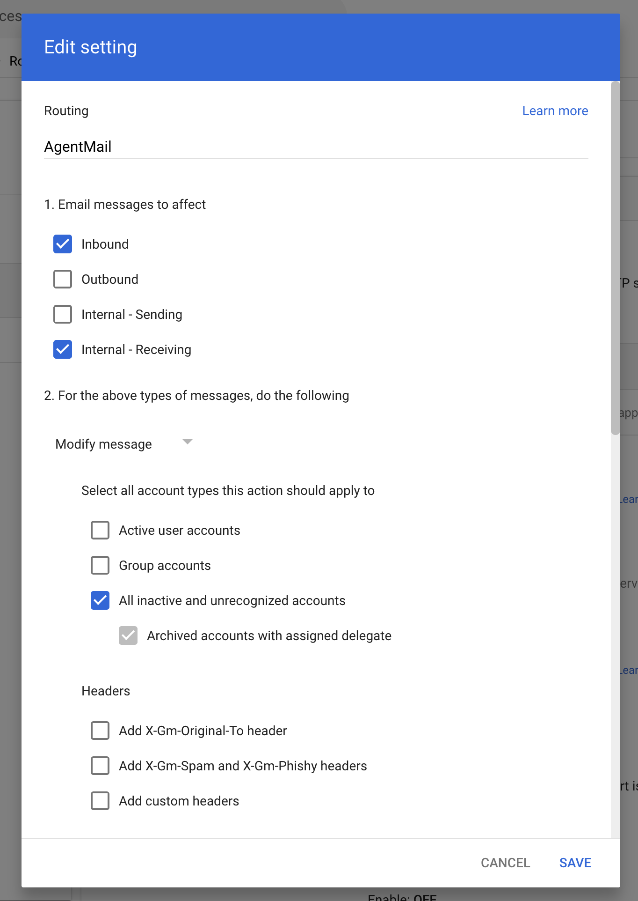
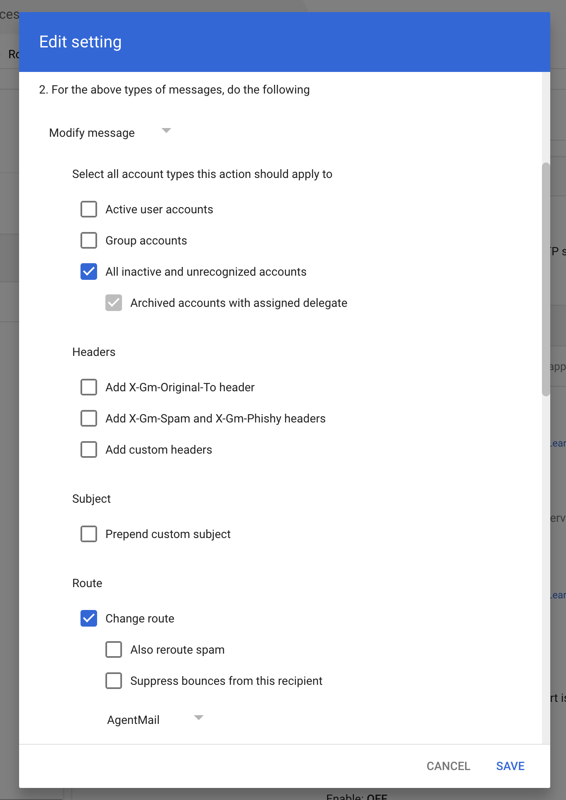

## Shared domains

Custom domains help establish trust with your recipients. We recommend configuring a dedicated domain or subdomain with AgentMail. However, sometimes you need to use your primary domain, which may already be managed by another email provider.

It is possible to use the same domain with both Google Workspace and AgentMail. This guide walks you through that configuration.

## DNS records

The initial setup is the same as any domain: add the AgentMail DNS records. These records will not interfere with your existing Google Workspace setup.

Even after adding these records, AgentMail will not receive email sent to your domain by default. This is because the AgentMail MX record has a priority of `10`, while Google's MX record is typically set to `1` (lower numbers take higher priority).

Your MX records should look like this:

| Priority | Host                                    |
| -------- | --------------------------------------- |
| `1`      | `smtp.google.com`                       |
| `10`     | `feedback-smtp.us-east-1.amazonses.com` |

## Google Workspace configuration

Next, navigate to the [Google Workspace admin console](https://admin.google.com). You will configure Gmail to route emails for unrecognized addresses to AgentMail.

In the left menu, navigate to **Apps → Google Workspace → Gmail**.

### Configure host

First, add AgentMail as a mail host. This tells Gmail which server to route emails to.

In the **Hosts** section, click **Add Route**.

Configure the route with the following settings:

1. Set the name to **AgentMail**
2. Select **Single host**
3. Enter `inbound-smtp.us-east-1.amazonaws.com` for the host name
4. Enter `25` for the port
5. Check the recommended options
6. Click **Save**

### Configure routing rule

Navigate back to the **Gmail** settings page and scroll to the **Routing** section at the bottom.

In the routing settings, click **Add another rule**.

Check **Inbound** and **Internal - Receiving**, then set the action to **Modify message**.

Scroll down and check **All inactive and unrecognized accounts**. Check **Change route** and select the **AgentMail** route from the dropdown.

Click **Save** to apply the rule. Emails sent to addresses that don't belong to existing Gmail accounts will now be routed to AgentMail.
