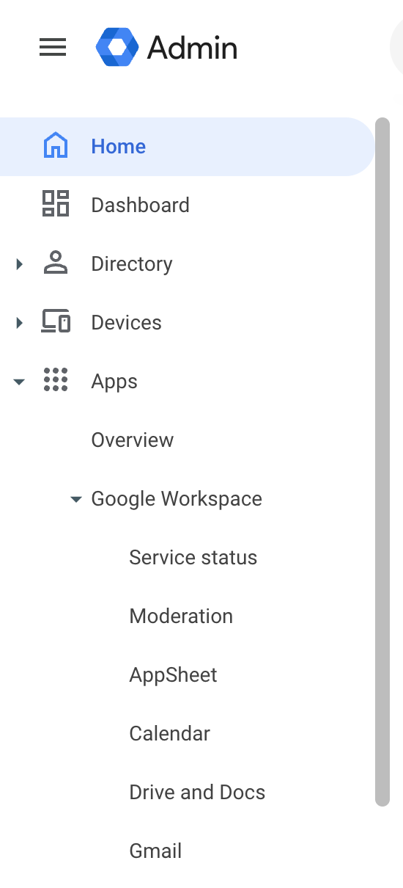
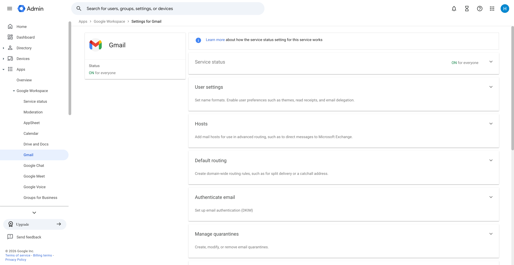
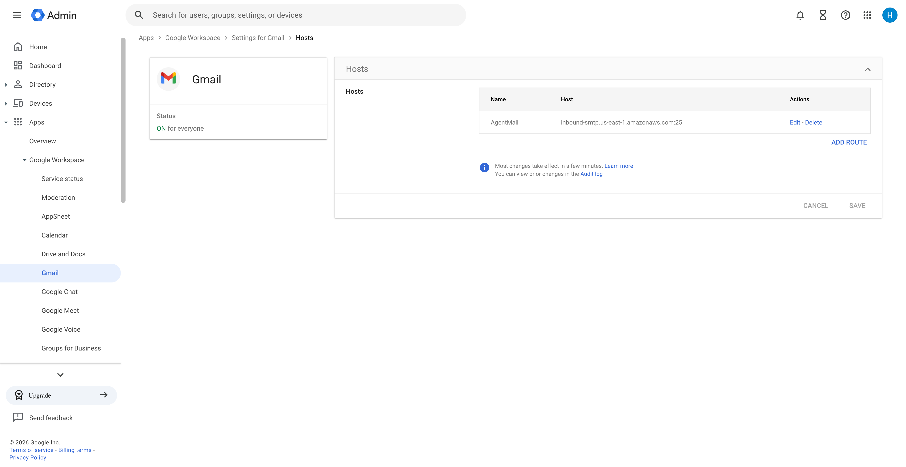
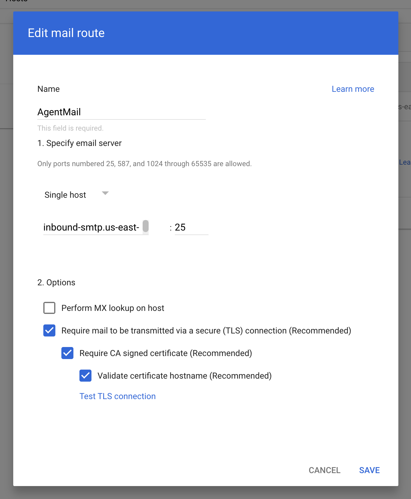
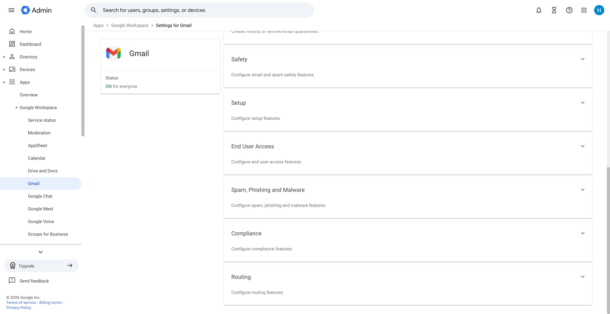
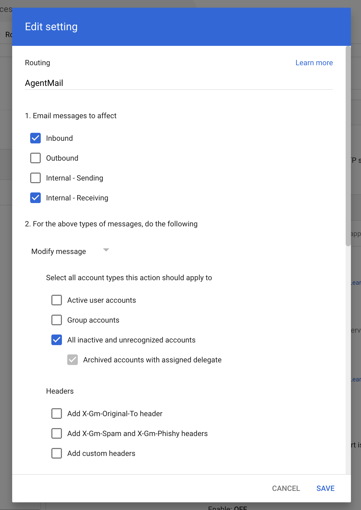
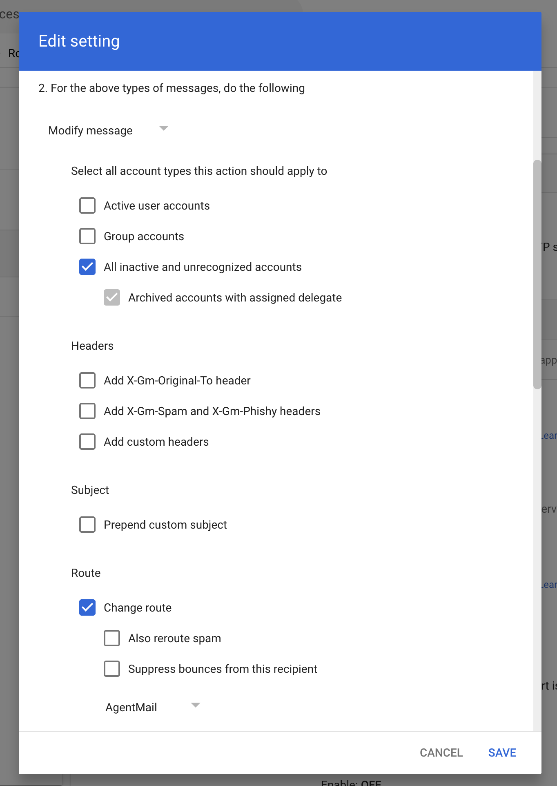

## Shared domains

Custom domains help establish trust with your recipients. We recommend configuring a dedicated domain or subdomain with AgentMail. However, sometimes you need to use your primary domain, which may already be managed by another email provider.

It is possible to use the same domain with both Google Workspace and AgentMail. This guide walks you through that configuration.

## Register the shared domain

Register your domain with [`POST /v0/domains`](/api-reference/domains/create), setting `allow_conflicting_provider` to `true`:

```bash
curl --request POST 'https://api.agentmail.to/v0/domains' \
  --header "Authorization: Bearer $AGENTMAIL_API_KEY" \
  --header 'Content-Type: application/json' \
  --data '{"domain": "example.com", "allow_conflicting_provider": true}'
```

Replace `example.com` with your domain and set `AGENTMAIL_API_KEY` to your API key. Use the API base URL for your account's region.

The flag defaults to `false`. Without it, registration returns `422` when Google Workspace MX records are detected, even if you have already configured Google's routing rule or validated TLS for the AgentMail host. Setting it to `true` allows registration alongside your existing provider; it does not configure DNS or Google Workspace routing.

## DNS records

Add the DNS records returned by registration manually, preserving your existing Google Workspace MX records. Publish the AgentMail DKIM and `mail` subdomain records, and preserve your existing DMARC policy if one is already configured.

Google should remain the preferred mail server for your domain: Google's MX record is typically priority `1`, while AgentMail's receiving MX record is priority `10` (lower numbers take higher priority). MX priority alone does not route unrecognized addresses to AgentMail; configure the Google Workspace routing rule below.

For a US-region domain named `example.com`, the MX records look like this. Use the exact names and regional targets returned in your domain's `records`:

| DNS name | Priority | Mail server |
| --- | --- | --- |
| `example.com` | `1` | `smtp.google.com` |
| `example.com` | `10` | `inbound-smtp.us-east-1.amazonaws.com` |
| `mail.example.com` | `10` | `feedback-smtp.us-east-1.amazonses.com` |

If you already use Google's legacy MX records, keep those records and their priorities, with Google preferred over AgentMail.

<Warning>
`feedback-smtp` handles bounces for the custom MAIL FROM subdomain (`mail.example.com`). It belongs on that subdomain, not at the root domain or in Google's mail host configuration. Incoming messages use `inbound-smtp`.
</Warning>

## Google Workspace configuration

Next, navigate to the [Google Workspace admin console](https://admin.google.com). You will configure Gmail to route emails for unrecognized addresses to AgentMail.

In the left menu, navigate to **Apps → Google Workspace → Gmail**.





### Configure host

First, add AgentMail as a mail host. This tells Gmail which server to route emails to.

In the **Hosts** section, click **Add Route**.



Configure the route with the following settings:

1. Set the name to **AgentMail**
2. Select **Single host**
3. Enter `inbound-smtp.us-east-1.amazonaws.com` for the host name
4. Enter `25` for the port
5. Check the recommended options
6. Click **Save**



### Configure routing rule

Navigate back to the **Gmail** settings page and scroll to the **Routing** section at the bottom.



In the routing settings, click **Add another rule**.

Check **Inbound** and **Internal - Receiving**, then set the action to **Modify message**.



Scroll down and check **All inactive and unrecognized accounts**. Check **Change route** and select the **AgentMail** route from the dropdown.



Click **Save** to apply the rule. Emails sent to addresses that don't belong to existing Gmail accounts will now be routed to AgentMail.

## Inboxes and catch-all behavior

Google's routing rule forwards unrecognized addresses to AgentMail. By default, each destination address must already have an AgentMail inbox; the rule does not create inboxes or collect unknown recipients into a single catch-all inbox. Create the inboxes you intend to receive mail at before using those addresses.
