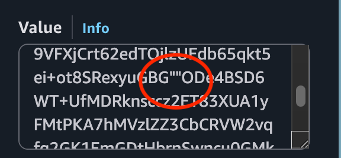
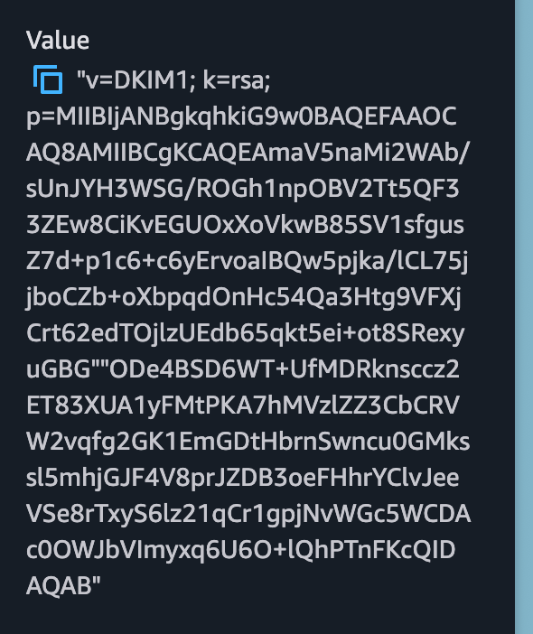

## Steps

1. Log in to the [AWS Management Console](https://console.aws.amazon.com)
2. Navigate to **Route 53**, then select **Hosted Zones**
3. Click on your domain's hosted zone
4. Click **Create Record** for each record AgentMail requires

<Note>
If your domain is registered with a different registrar but uses Route 53 for DNS, make sure the NS records at your registrar match the name servers listed in your hosted zone.
</Note>

## Adding a TXT Record (SPF)

| Field | Value |
| --- | --- |
| Record name | Leave blank for root domain, or enter your subdomain |
| Record type | `TXT` |
| Value | `"v=spf1 include:agentmail.to ~all"` |
| TTL | `300` |

<Warning>
Route 53 requires TXT values to be **wrapped in double quotes**. If you omit the quotes, the record will fail validation. Also, if you already have an SPF record, add `include:agentmail.to` to the existing record rather than creating a second one. Multiple SPF records on the same domain will cause authentication failures.
</Warning>

## Adding a CNAME Record (DKIM)

| Field | Value |
| --- | --- |
| Record name | The DKIM selector from AgentMail (e.g., `agentmail._domainkey`) |
| Record type | `CNAME` |
| Value | The DKIM target from AgentMail |
| TTL | `300` |

CNAME values should **not** be wrapped in quotes.

## Adding an MX Record (Receiving)

| Field | Value |
| --- | --- |
| Record name | Leave blank for root domain, or enter your subdomain |
| Record type | `MX` |
| Value | `10 inbound.agentmail.to` |
| TTL | `300` |

Route 53 MX records use the format `priority server` separated by a space (e.g., `10 inbound.agentmail.to`). Do not wrap MX values in quotes.

If you want to receive emails on a subdomain to avoid conflicts with your existing email provider, enter the subdomain in the Record name field instead of leaving it blank.

## Verification

After adding all records, go back to the [AgentMail Console](https://console.agentmail.to) and click **Verify Domain**.

Route 53 name servers typically pick up changes within **60 seconds**, but full propagation to all DNS resolvers may take longer depending on TTL and resolver caching. In practice, most changes are visible within a few minutes.

## Common Route 53 Issues

- **TXT records must be quoted:** Unlike most DNS providers, Route 53 requires double quotes around TXT record values. If your SPF or other TXT records are missing quotes, they won't validate.

- **CNAME at root domain:** Route 53 does not allow CNAME records on the root domain (zone apex). If you need to set up DKIM, the selector (e.g., `agentmail._domainkey`) is a subdomain, so this is typically not an issue. However, if you run into conflicts, consider using a subdomain for sending.

- **Existing SPF record:** If you already have a TXT record starting with `v=spf1`, add `include:agentmail.to` before the `~all` or `-all` in that existing record. Do not create a second SPF TXT record.

- **Routing policy:** When creating records, use **Simple routing** unless you have a specific reason to use weighted, latency, or other routing policies. Other policies can cause unexpected DNS behavior for email records.

- **Multiple values in one record:** Route 53 lets you add multiple values to a single record. If you need to add a second MX entry, add it as a new line in the same MX record rather than creating a separate record.

- **DKIM TXT record too long (CharacterStringTooLong error):** If your DKIM record is provided as a TXT value (rather than a CNAME), the DKIM public key is often longer than the 255-character limit that Route 53 enforces per string segment. You will see an error like `CharacterStringTooLong (Value is too long)`. To fix this, split the value into two quoted strings within a single record. The split point should be near the middle of the `p=` value. The two quoted strings must have **no space and no line break** between the closing and opening quotes. For example:

  ```
  "v=DKIM1; k=rsa; p=MIIBIjANBgkqhki...firsthalf""secondhalf...wIDAQAB"
  ```

  In Route 53, paste the entire value (both quoted strings) into the **Value** field as a single entry. If Route 53 shows two separate copy-pastable values instead of one, there is likely a space or line break between the two strings. Remove it so the closing `"` and opening `"` are directly adjacent (`""`).

  **Incorrect:** A space or line break between the two quoted strings causes Route 53 to treat them as separate values.

  

  **Correct:** The two quoted strings are directly adjacent with no space, producing a single value in Route 53.

  

  You can also use the AWS CLI to add the record, which handles multi-string TXT values more reliably.
