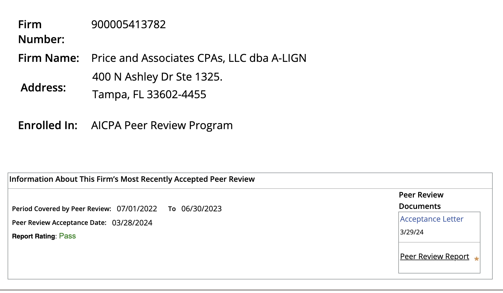

_Last updated: September 23, 2026_

**AgentMail is SOC 2 Type II compliant.**

We completed our first SOC 2 Type II audit in 2025. Our 2026 annual audit is underway with A-LIGN, an independent CPA firm.

<figure>
  
  <figcaption>A-LIGN’s AICPA peer-review record, covering July 1, 2022 to June 30, 2023, accepted March 28, 2024.</figcaption>
</figure>

Our compliance program runs on Vanta, which monitors our security controls continuously and collects audit evidence automatically.

## What is SOC 2?

SOC 2 is an audit standard from the AICPA. A Type I report checks controls at a single point in time. A Type II report tests that those controls worked over an observation period.

## How can I access your reports?

Visit our [Trust Center](https://app.vanta.com/agentmail.to/trust/1oqosh1a62stku80d8hdep) to view our live control status and request:

- Our 2025 SOC 2 Type II report
- Our security policies

Documents are available to customers and prospects after access approval.

## Security questionnaires

Request access through our [Trust Center](https://app.vanta.com/agentmail.to/trust/1oqosh1a62stku80d8hdep) and our team will work through your review with you.
